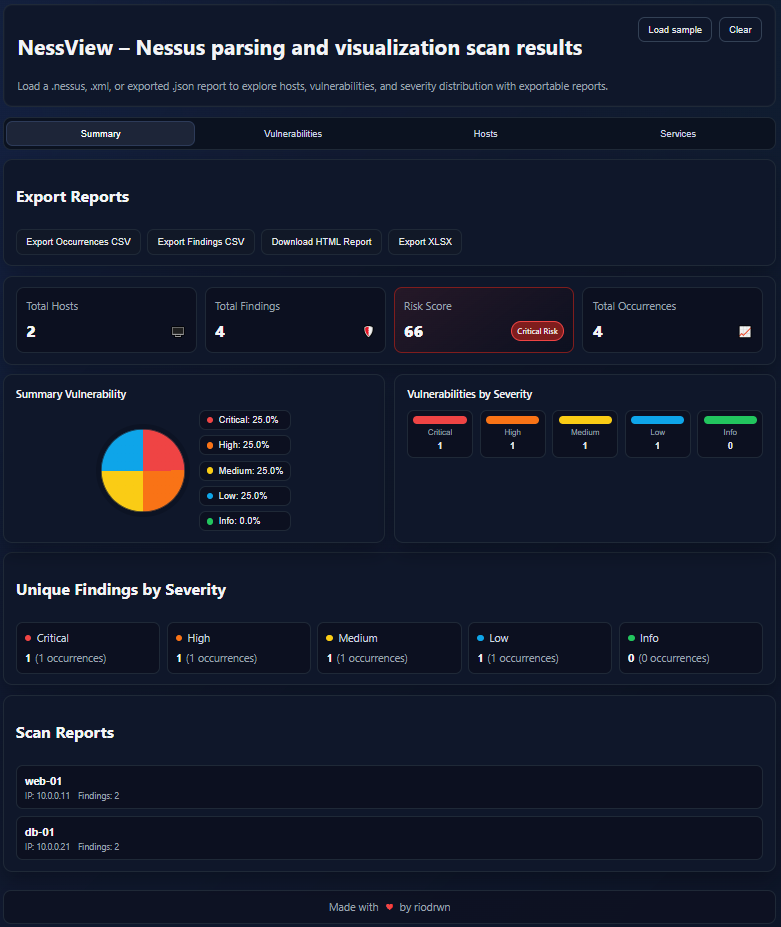

# NessView

NessView is a client-side Nessus/Tenable report viewert. Drop in .nessus, .xml, or exported .json files to explore hosts, vulnerabilities, services, and severity distribution with exportable reports. No data leaves your browser.



---

## Highlights
- 100% client-side parsing and visualization. Nothing is uploaded to servers.
- Drag and drop or file picker for .nessus, .xml, and Tenable JSON exports (sample file included).
- Dashboards for severity distribution, overall risk score, and KPIs.
- Dedicated views: Summary, Vulnerabilities, Hosts, Services with filters and accordions.
- Exports: CSV (occurrences and findings), XLSX workbook (hosts, findings, scan info, severity tabs, vuln-to-IP summary), printable HTML summary.
- SPA-friendly: works entirely in the browser; files stay in memory until you close the tab.

## Quick start (local)
```bash
npm ci
npm run dev
```
Open the Vite URL shown in the terminal, then drag and drop a Nessus/Tenable export or click to browse. Use **Load sample** to demo the UI; **Clear** resets state.

## Run with Docker Compose
```bash
docker compose build
docker compose up -d
```
Then open http://localhost:4173/. Stop with `docker compose down`.

## Usage
- Tabs: Summary (charts, cards, exports), Vulnerabilities (plugin list with copy helper), Hosts (accordion per host with findings), Services (ports/protocols with host list).
- Filters: click severity in charts to focus on that bucket; click again to reset.
- Exports: use the export bar on Summary to download CSV, XLSX, or HTML.
- Copy: in Vulnerabilities, copy plugin details to the clipboard; a toast confirms.

## Export details
- `nessus-occurrences.csv`: every finding instance by host.
- `nessus-findings.csv`: unique findings with counts and affected host counts.
- XLSX workbook: `Hosts`, `ScanInfo`, `Findings`, `Vuln_to_IP_Summary`, plus severity-specific sheets with colored tabs.
- HTML: top findings and top hosts summary for quick sharing.

## Privacy and data handling
- Runs entirely in-browser; no network calls.
- Files remain in memory; close the tab to clear them.

## Tech stack
- Vite + React + TypeScript
- fast-xml-parser for Nessus XML
- xlsx for spreadsheet exports

## Development scripts
- `npm run dev` - start dev server
- `npm run build` - type-check and production build
- `npm run preview` - preview the built app
- `npm run lint` - type-check only

## Contributing
Issues and PRs are welcome. If you spot bugs, UX rough edges, or have ideas for new exports/visualizations, open an issue or submit a PR.

## License
MIT (see LICENSE if present).
